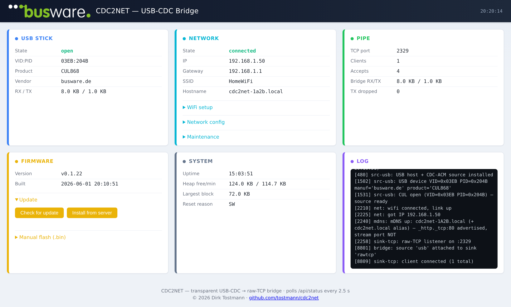

# CDC2NET

Transparent **USB-Host-CDC → network bridge** for the ESP32-S3 — a
ser2net-style gateway that puts an unmodified USB serial stick onto the
network (WiFi now, Ethernet later) **without touching the stick's firmware**.

Built for the **CUL / TUL / EUL** line, but it bridges any common USB serial
stick:

- **native CDC-ACM** — legacy CUL (LUFA / ATmega32U4) and the USB-Serial-JTAG
  of modern ESP32-C3/C6 devices
- **USB-serial bridge chips** — FTDI (FT2xx), WCH CH340 / CH341, and Silicon
  Labs CP210x, opened through their vendor (VCP) drivers so the chip wire
  framing is handled and the UART baud is actually set

The S3 is the USB host: it opens the stick and fans its raw byte stream out to
TCP clients (multi-client). Raw clients get a plain socket — no framing — so
FHEM and friends talk to it exactly like a local `CUL`, just over `host:port`;
clients that need to set the line rate at runtime can use **RFC2217** on the
same port.



## Features

- **Transparent raw-TCP pipe** — default port `2329`, multiple clients fan-out.
- **USB host, multi-chip** — native CDC-ACM (CUL/TUL/EUL, C3/C6
  USB-Serial-JTAG) **plus** the common USB-serial bridge chips — FTDI FT2xx,
  WCH CH340/CH341, Silicon Labs CP210x — via their VCP drivers; shows the
  stick's USB vendor/product strings.
- **Per-port serial config** — baud / data bits / parity / stop bits per
  device, set in the web UI and persisted in NVS (keyed by the stick's USB
  serial, else its VID:PID). Native CDC sticks (culfw) are baud-agnostic;
  real-UART bridges get the wire rate set.
- **RFC2217** — optional dynamic serial config (telnet COM-PORT-OPTION) over
  the raw-TCP port. Raw clients stay byte-transparent; a single controlling
  connection owns the line parameters.
- **WiFi onboarding** — Improv-Serial right after flashing, or a captive
  portal. Static-IP or DHCP, configurable TCP port, a connectivity watchdog.
- **Web UI** on port 80 — status, configuration, logs, and OTA.
- **OTA updates** — upload a `.bin` from the browser, or pull a release
  straight from the update server.
- **mDNS** — reachable as `cdc2net.local` (plus a unique `cdc2net-XXXX.local`);
  advertises `_http._tcp` for the web UI. The stream port is deliberately
  *not* advertised — what's on the host port is module-dependent.
- **One-click web flasher** — install over Web Serial from the browser.

## Why the S3

Only the ESP32-S2/S3/P4 have a USB-OTG **host** peripheral — a C3/C6 cannot be
the host. WiFi-only for now; a **W5500 Ethernet** option is planned (the
network layer is already link-abstracted for it).

## Install

### Web flasher (easiest)

Open **<https://install.busware.de/cdc2net/>** in a Chromium-based desktop
browser (Chrome / Edge / Opera / Brave — Web Serial isn't available in
Safari, Firefox, or on mobile), plug the S3 board into USB, and click
**Install**. The browser detects the chip and writes the factory image; WiFi
is handed over via Improv right after flashing.

> The flasher programs the **ESP32-S3 bridge board** — *not* the CUL/TUL/EUL
> stick. Your sticks keep their own firmware (culfw / a-culfw); CDC2NET only
> carries their serial line over the network.

### Manual flash

Grab `factory_cdc2net_esp32s3.bin` from the flasher directory and write it
with [esptool](https://github.com/espressif/esptool):

```sh
esptool.py --chip esp32s3 -p /dev/ttyACM0 write_flash 0x0 factory_cdc2net_esp32s3.bin
```

`firmware.bin` next to it is the app-only image used by the in-device OTA.

## Use

After flashing and WiFi onboarding, the device comes up as `cdc2net.local`.
Plug a stick into the host port and point your software at the raw-TCP port
(default `2329`). In FHEM:

```
define CUL_0 CUL cdc2net.local:2329 1234
```

Open `http://cdc2net.local/` for live status, WiFi/network/port
configuration, logs, and firmware updates.

## Build from source

PlatformIO with the ESP-IDF framework (IDF 5.5.x via `espressif32@6.13.0`):

```sh
cd firmware
pio run                       # build (pre-build hook bumps version + git-snapshots)
pio run -t upload             # flash over USB (set upload_port first)
pio device monitor            # 115200 baud, console on UART0
```

Release artifacts for the web flasher are produced by `firmware/scripts/release.sh`.

> **Build note (ESP-IDF #15079):** on the S3 the USB-OTG and USB-Serial-JTAG
> controllers share one USB PHY. Bringing up the WiFi PHY disables the USB PHY
> unless `CONFIG_ESP_PHY_ENABLE_USB=y` is set — which it is, in
> `firmware/sdkconfig.defaults`. Without it, the host stops enumerating once
> WiFi associates.

## Layout

```
firmware/            ESP-IDF (PlatformIO) project — the device firmware
firmware/web/        web UI sources (gzipped + embedded into the firmware)
firmware/scripts/    version bump + web-asset embed + release packaging
webflasher/          ESP Web Tools manifest + landing page (release artifacts)
images/              screenshots / assets for this README
docs/                design notes and roadmap
```

## License

CDC2NET is licensed under the **GNU General Public License v2.0 or later**
(GPL-2.0-or-later) — see [`LICENSE`](LICENSE) for the full text. Every source
file carries an `SPDX-License-Identifier: GPL-2.0-or-later` header.

© 2026 Dirk Tostmann. The vendored ESP-IDF components under
`firmware/components/` retain their own upstream licenses (Apache-2.0 / MIT).

---

CDC2NET · © 2026 Dirk Tostmann · <https://github.com/tostmann/cdc2net> ·
hosted at [busware.de](https://busware.de)
