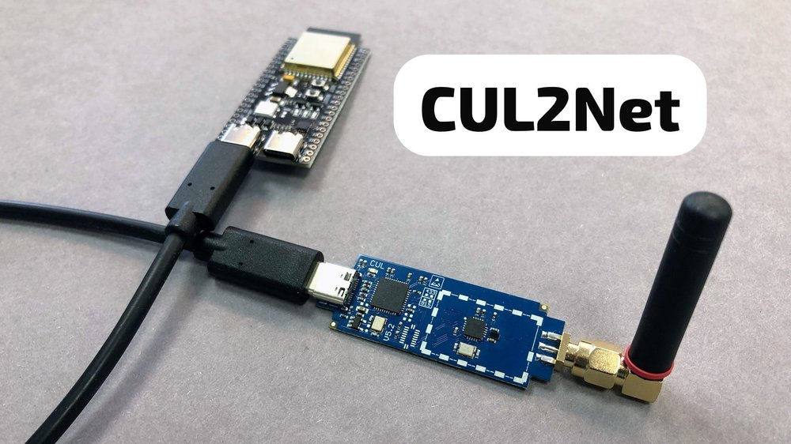
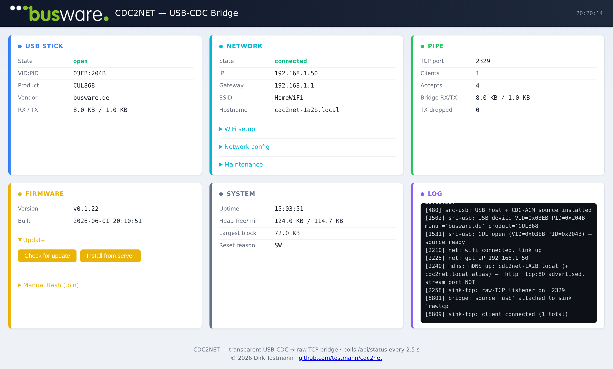

# CDC2NET

Transparent **USB-Host-CDC → network bridge** for the ESP32-S3 — a
ser2net-style gateway that puts an unmodified USB serial stick onto the
network (WiFi, or wired Ethernet where the board has it) **without touching
the stick's firmware**.

Built for the **CUL / TUL / EUL** line, but it bridges any common USB serial
stick:

- **native CDC-ACM** — legacy CUL (LUFA / ATmega32U4) and the USB-Serial-JTAG
  of modern ESP32-C3/C6 devices
- **USB-serial bridge chips** — FTDI (FT2xx), WCH CH340 / CH341, and Silicon
  Labs CP210x, opened through their vendor (VCP) drivers so the chip wire
  framing is handled and the UART baud is actually set

The S3 is the USB host: it opens the stick and fans its raw byte stream out to
TCP clients (multi-client). Raw clients get a plain socket — no framing — so
FHEM and friends talk to it exactly like a local `CUL`, just over `host:port`;
clients that need to set the line rate at runtime can use **RFC2217** on the
same port.





## Features

- **Transparent raw-TCP pipe** — default port `2329`, multiple clients fan-out.
- **USB host, multi-chip** — native CDC-ACM (CUL/TUL/EUL, C3/C6
  USB-Serial-JTAG) **plus** the common USB-serial bridge chips — FTDI FT2xx,
  WCH CH340/CH341, Silicon Labs CP210x — via their VCP drivers; shows the
  stick's USB vendor/product strings.
- **Per-port serial config** — baud / data bits / parity / stop bits per
  device, set in the web UI and persisted in NVS (keyed by the stick's USB
  serial, else its VID:PID). Native CDC sticks (culfw) are baud-agnostic;
  real-UART bridges get the wire rate set.
- **RFC2217** — optional dynamic serial config (telnet COM-PORT-OPTION) over
  the raw-TCP port. Raw clients stay byte-transparent; a single controlling
  connection owns the line parameters.
- **WiFi onboarding** — Improv-Serial right after flashing, or a captive
  portal. Static-IP or DHCP, configurable TCP port, a connectivity watchdog.
- **Wired Ethernet (W5500)** — on carrier boards that have one: picked up by
  DHCP at boot, takes precedence over WiFi, and the fallback access point stays
  off while the link is up.
- **Web UI** on port 80 — status, configuration, logs, and OTA.
- **OTA updates** — upload a `.bin` from the browser, or pull a release
  straight from the update server.
- **mDNS** — reachable as `cdc2net.local` (plus a unique `cdc2net-XXXX.local`);
  advertises `_http._tcp` for the web UI. The stream port is deliberately
  *not* advertised — what's on the host port is module-dependent.
- **Reflash the attached CUL** — USB-source builds can push a new firmware
  into an attached ATmega32U4 stick through its DFU bootloader, from the web
  API, no PC and no cable change; see [`docs/cul-dfu.md`](docs/cul-dfu.md).
- **One-click web flasher** — install over Web Serial from the browser.

## Why the S3

Only the ESP32-S2/S3/P4 have a USB-OTG **host** peripheral — a C3/C6 cannot be
the host.

The network layer is link-abstracted: WiFi is the uplink on a plain S3 dev
board, while builds whose carrier board carries a **W5500** get wired Ethernet
as well (`firmware/main/net_eth.c`, enabled on the gateway build and the C6
stick builds). An absent W5500 is detected and skipped, so the same code runs
on boards without one.

## Install

### Web flasher (easiest)

Open **<https://install.busware.de/cdc2net/>** in a Chromium-based desktop
browser (Chrome / Edge / Opera / Brave — Web Serial isn't available in
Safari, Firefox, or on mobile), plug the S3 board into USB, and click
**Install**. The browser detects the chip and writes the factory image; WiFi
is handed over via Improv right after flashing.

> The flasher programs the **ESP32-S3 bridge board** — *not* the CUL/TUL/EUL
> stick. Your sticks keep their own firmware (culfw / a-culfw); CDC2NET only
> carries their serial line over the network.

### Manual flash

Grab `factory_cdc2net_esp32s3.bin` from the flasher directory and write it
with [esptool](https://github.com/espressif/esptool):

```sh
esptool.py --chip esp32s3 -p /dev/ttyACM0 write_flash 0x0 factory_cdc2net_esp32s3.bin
```

`firmware.bin` next to it is the app-only image used by the in-device OTA.

### Zigbee gateway variant (ESP32-S3 + ESP32-H2 board)

A second build targets Espressif's **ESP Thread Border Router / Zigbee Gateway
board** and turns it into a **network-attached Zigbee coordinator**: the
on-board ESP32-H2 runs the
[esp-coordinator](https://github.com/tostmann/esp-coordinator) ZBOSS NCP
firmware, and CDC2NET on the S3 bridges its frame stream to `:2329` over
Ethernet or WiFi. Zigbee2MQTT connects with `adapter: zboss` and
`port: tcp://<gateway-ip>:2329`.

**<https://install.busware.de/cdc2net/zbgw/>** — one click writes both chips:
the S3 image carries the H2's firmware in a dedicated `radio_fw` partition and
flashes it over the inter-chip UART on first boot (MD5-verified). Later boots
verify the radio's application against the staged image (MD5) and rewrite only
on a mismatch, so a gateway update leaves a matching radio untouched, and an
erased or half-written H2 is repaired automatically.

> Flash the socket marked **`USB2`** — that is the ESP32-S3. The board's other
> USB-C (`USB1`) goes to the ESP32-H2 and cannot write this image.

> This overwrites Espressif's factory firmware on **both** chips; the way back
> to a Thread border router (Espressif's esp-thread-br firmware) is untested
> here.

Design notes — radio-flash policy, partition layout, board wiring, the 8 MB
flash decision and the PSRAM finding — are in [`docs/zbgw.md`](docs/zbgw.md).

## Use

After flashing and WiFi onboarding, the device comes up as `cdc2net.local`.
Plug a stick into the host port and point your software at the raw-TCP port
(default `2329`). In FHEM:

```
define CUL_0 CUL cdc2net.local:2329 1234
```

> **Power the host port.** The stick draws its 5 V from the S3's USB-OTG host
> port, so that port has to actually supply VBUS. On dev boards with a passive
> VBUS path (no on-board 5 V switch) the host port only passes through what the
> board is fed — feed the board from a solid 5 V source. If a stick doesn't
> enumerate, check VBUS at the host connector first: it should sit near 5 V (a
> sagging ~4.5 V already causes flaky or failed enumeration).

Open `http://cdc2net.local/` for live status, WiFi/network/port
configuration, logs, and firmware updates.

## Build from source

PlatformIO with the ESP-IDF framework (IDF 5.5.x via `espressif32@6.13.0`):

```sh
cd firmware
pio run                       # build (pre-build hook bumps version + git-snapshots)
pio run -t upload             # flash over USB (set upload_port first)
pio device monitor            # 115200 baud, console on UART0
```

Release artifacts for the web flasher are produced by `firmware/scripts/release.sh`.

> **Build note (ESP-IDF #15079):** on the S3 the USB-OTG and USB-Serial-JTAG
> controllers share one USB PHY. Bringing up the WiFi PHY disables the USB PHY
> unless `CONFIG_ESP_PHY_ENABLE_USB=y` is set — which it is, in
> `firmware/sdkconfig.defaults`. Without it, the host stops enumerating once
> WiFi associates.

## Layout

```
firmware/            ESP-IDF (PlatformIO) project — the device firmware
firmware/web/        web UI sources (gzipped + embedded into the firmware)
firmware/scripts/    version bump + web-asset embed + release packaging
webflasher/          ESP Web Tools manifest + landing page (release artifacts)
images/              screenshots / assets for this README
docs/                design notes, per-variant and per-feature documentation
```

## License

CDC2NET is licensed under the **GNU General Public License v2.0 or later**
(GPL-2.0-or-later) — see [`LICENSE`](LICENSE) for the full text. Every source
file carries an `SPDX-License-Identifier: GPL-2.0-or-later` header.

© 2026 Dirk Tostmann. The vendored ESP-IDF components under
`firmware/components/` retain their own upstream licenses (Apache-2.0 / MIT).

---

CDC2NET · © 2026 Dirk Tostmann · <https://github.com/tostmann/cdc2net> ·
hosted at [busware.de](https://busware.de)
